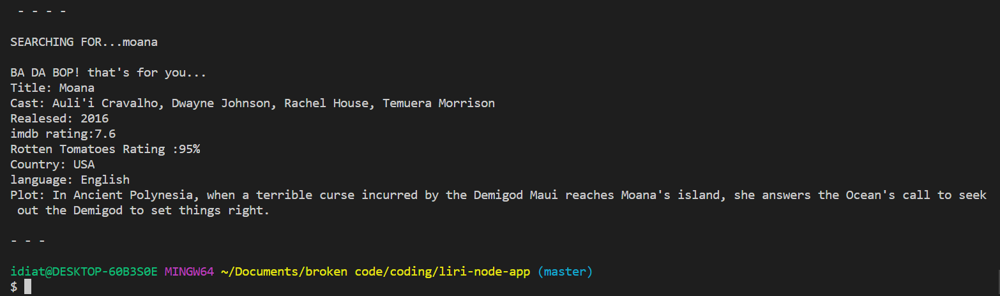

##liri-node-app
Welcome to my LIRI Application if you like it please check out my Github Profile to see my repositories.

LIRI is a Language Interpretation and Recognition Interface. LIRI is designed to be a command line node app that takes in parameters and displays data to the console.

LIRI will search:

Spotify for songs

Bands in Town for concerts

OMDB for movies.

Using Axios to make the calls to Bands In Town API & OMDB API

Using the node-spotify-api npm package to make the spotify API calls

Utilizing Inquirer npm to take in user input for addional searches & Allow more then one command to be ran each execution of the application.

This application Allows the user to search 3 different API's determined by the inputted command line arguements.
The liri command line node application allows you to search three separate APIs quickly in one application to display Data, using keywords for the commands to determine which API to search then the app will display the results of that API's response to the console after api request is done.

How the liri.js App works
node liri spotify-this-song < song name > Spotify API Track Search Endpoint

node liri movie-this < movie name > OMDB API

node liri concert-this < artist or band > Bands In Town API

node liri do-what-it-says (will read from the random.txt file.)

The LIRI application utilizes and requires these npm packages:

Moment

DotEnv

Axios

inquirer

node-spotify-api

#Getting Started with the LIRI node command line application
WARNING: If you are not familiar with the bash/terminal this app may not be suitible for you but feel free to try anyways.

Welcome user! So you want to use my command line node app? Okay! lets get started.

You are going to need to have Node.js Installed in order to run this javascript file in the terminal or command line.

Assuming you are familiar with node as well as the terminal/cli and are ready to move on continue to the next steps

STEP ONE:

You will need to go to my Github repository, you can then either fork the repository and copy the Clone with HTTPS link then run the following command with the link copied from your forked version of the repo to replace what comes after "git clone" from your terminal or bash window or clone my repository the same way using the link on my Github repo the command will look like this in the terminal/CLI:
Command:

git clone https://github.com/idiatou69/liri-node-app
Once you have searched for anything or if you didn't enter a valid command you will be prompted to select one of the three API call commands

concert-this < Band/artist > will display:

Name of the venue
Venue location
Date of the Event (formatted as "MM/DD/YYYY" using moment)
spotify-this-song < song/track > will display:

Artist(s)
The song's name
A preview link of the song from Spotify
The album that the song is from
movie-this < movie/film > will display:

Title of the movie.
Year the movie came out.
IMDB Rating of the movie.
Rotten Tomatoes Rating of the movie.
Country where the movie was produced.
Language of the movie.
Plot of the movie.
Actors in the movie.
Here are the four valid commands the liri application will accept initially running the application.

node liri concert-this ariana grande
node liri spotify-this-song thank u next
node liri movie-this moana
node liri do-what-it-says

The command:

node liri concert-this ariana grande
Will display:

The command:

node liri spotify-this-song thank u next
Will display:

The command:

node liri movie-this moana
Will display:

node liri do this 
will display:

